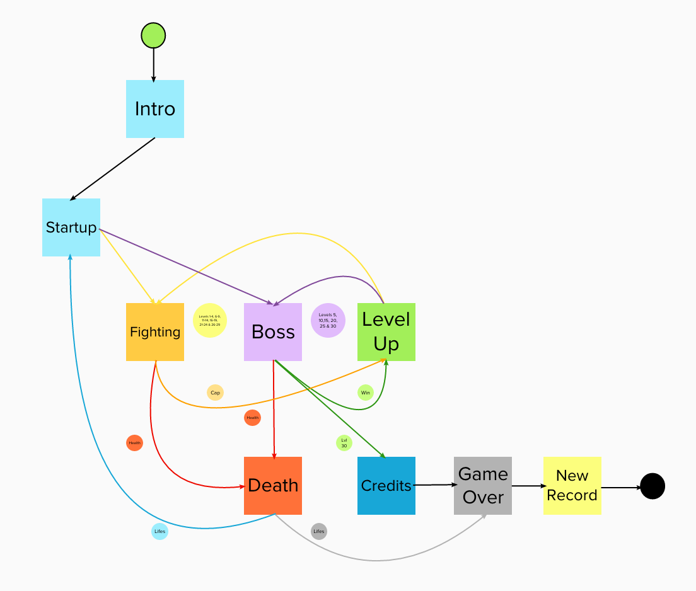

# Space F14


**Space F14** is a 2D arcade video game developed using `.NET` (C# language) and `MonoGame` frameworks.

## Requirements (MacOS/Windows)

* .NET Framework (C#)
  * .NET SDK: **v6.0**
  * .NET Core App: **v3.1**
* MonoGame
  * Tested on: **v3.8.0**

**Note:** MonoGame Framework `v3.8.0` doesn't have support for `Microsoft Visual Studio Code 2022` or `Microsoft Visual Studio 2019 for Mac`.

### Install

* .NET SDK
  * Download .NET 6.0 installer from [here](https://dotnet.microsoft.com/en-us/download)
  * Download .NET Core App 3.1 installer from [here](https://dotnet.microsoft.com/en-us/download/dotnet/3.1)
* MonoGame templates
  * `dotnet new --install MonoGame.Templates.CSharp`
* MGCB Tool
  * `dotnet tool install -g dotnet-mgcb`

### Build

```shell
cd spacef14/SpaceF14
dotnet publish -c Release -r arch-x64 --self-contained
```

### Run

```shell
cd spacef14/SpaceF14
dotnet run
```

### Game Finite State Machine



### List of Contents

| **Directory** | **Description** |
|:---------------|:---------------|
| SpaceF14 | MonoGame Project with C# source code and configuration files. |
| SpaceF14Content | Original images, sprites, sounds, and fonts. Also, all compiled content used by the game through the MonoGame CB pipeline. |
|  |  |


### References

  * .NET Framework [page](https://dotnet.microsoft.com/en-us/)

  * MonoGame Framework [page](https://docs.monogame.net/index.html)


### Contributing

If you want to contribute to the module and make it better, your help is very welcome. You can do so submitting a **Pull Request**. It will be reviewed and merged to main branch if accepted.

### Reporting an issue

If you have found what you believe to be an issue with `spacef14` please do not hesitate to file an issue on the GitHub repository [here](https://github.com/rod4n4m1/spacef14/issues/new?template=bug-report.md).

### Suggesting a new feature

If you want to see new features or enhancements to the current ones, we would love to hear them. Please submit an issue on the GitHub repository [here](https://github.com/rod4n4m1/spacef14/issues/new?template=new-feature.md).

### Authors
Written by Rod Anami <rod.anami@kyndryl.com>, October 2019.

### Contributors


### License
This project is licensed under the [MIT](https://opensource.org/licenses/MIT).
